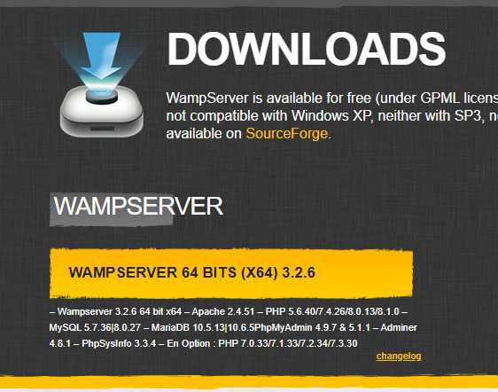
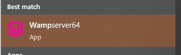
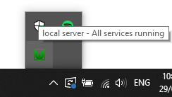

# Noteworthy Web Development

---

This is a public repository that I have put together primarily for use by the SENG1050 students of UoN Callagan, but doesn't contain any course specific information, it has or will include notes about PHP, XML, HTML, CSS, JavaScript, and introductory web development in general. For students, see README.md at the bottom of the page for getting WAMPserver set up in Windows and where to clone this repository to see the examples.

---

## Setting up WAMPserver



1. Download the latest version of WAMPserver from [here](http://www.wampserver.com/en/#download-wrapper) it'll likely redirect to SourceForge
2. Run the installer and follow the prompts to install it to the default location (i.e. C:\\wamp64) - WAMPserver is a collection of software that allows you to run a web server on your computer, it supports Apache, MySQL, and PHP
3. After installation, run WAMPserver64.exe from the start menu, it'll look like this:



4. A series of command prompts will open, starting up the Apache web server and doing some other housework you don't need to worry about. Once it's done, you'll see a green WAMPserver icon in the system tray in the bottom right, right click it if you're curious about what it is doing/is.



5. You can now open a web browser and navigate to [http://localhost](http://localhost) to see the default Apache page, if you see this, you're good to go! If you see a 404, 500, or similar error, you may have to restart WAMPserver.

6. You can now clone this repository to C:\\wamp64\\www\\ (and rename the folder to pass if you're a student) to see the examples, or you can create your own files in that directory to test out what you've learned so far (subdirectories such as the pass/ folder after you've cloned and renamed this are simply appended to the https://localhost/ URL). index.html or index.php is the default for that directory, so you can navigate to [http://localhost/pass/](http://localhost/pass/) after cloning the repository inside C:\\wamp64\\www\\ you'll be able to see these example pages.

---

## Getting started with PHP

PHP is a server-side scripting language (loosely-typed, and interpreted) that is used to generate dynamic web pages from the server and then serve static content (mainly HTML) to the client making the request, it can also process GET, POST, and other requests from the client and then perform some action off of that, such as updating a database.

To get started, based on what you've learnt so far, can you put together a calculator that takes two numbers "a" and "b" from the request (you can append them to the end of the URL with ?a=1&b=2 for example) and then returns the sum and other interesting results surrounding those two numbers? Try factorials, exponents, identifying whether they're prime, etc.

Tip:

```php
<?php

    // PHP code goes here - I suggest starting with this (be sure to read the styling guide and cheatsheet)
    
    $a = 0;
    $b = 0;
    
    if (array_key_exists("a", $_GET) && array_key_exists("b", $_GET)) {
        $a = $_GET["a"];
        $b = $_GET["b"];
    }

?>
```